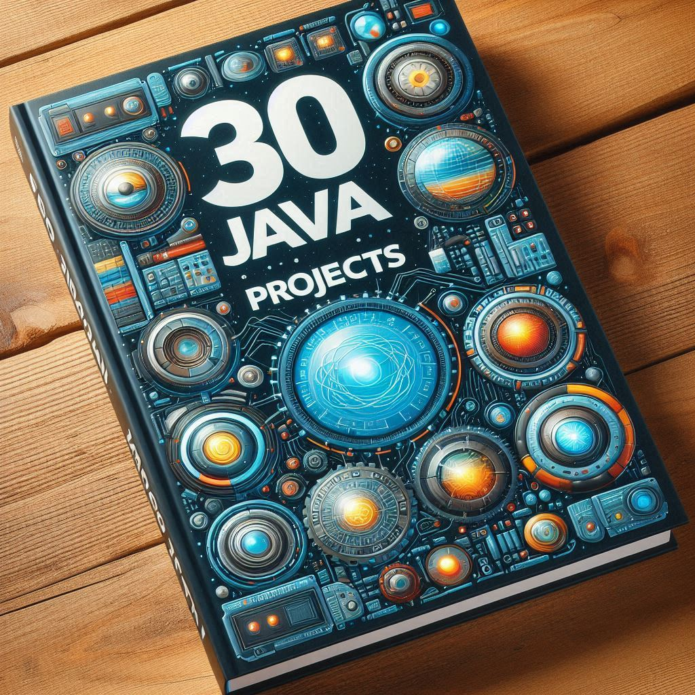

# 30 Proyectos De Java

La idea de este proyecto es facilitar una vía para que puedan practicar con ejercicios sencillos; no hace falta tener conocimientos avanzados para participar, esta metodología busca incentivar el crecimiento de conocimiento mediante la búsqueda de lo requerido para completar cada reto.
  
Ya que están aquí los invito a seguirme en mi perfil de GitHub.

  
### Día 1: Hola Mundo
Este es un sencillo programa de 'Hola Mundo' hecho con el lenguaje de programación Java. El repositorio contiene el código fuente, las instrucciones para compilar y ejecutar el programa.

Referencias:
- Tutorial: [Hola Estoy Empezando en Java]()
- GitHub Repo: [Repo]()

### Día 2: Calculadora básica
Desarrolla una calculadora básica que pueda realizar operaciones aritméticas simples como suma, resta, multiplicación y división.

Referencias:
- Tutorial: [Java Program to Make a Simple Calculator Using switch...case]()

### Día 3: Juego de adivinanza de números
Construye un juego en el que el programa genera un número aleatorio y el usuario tiene que adivinarlo.

Referencias:
- Tutorial: [Adivina el número en Java]()
- Relpl.it: [Demo]()

### Día 4: Convertidor de unidades
Crea un convertidor de unidades (como centímetros, yardas, kilómetros, etc.).

Referencias:
- Tutorial: [Conversión de unidades en Java]()

### Día 5: Verificador de palíndromos
Escribe un programa que verifique si una palabra o frase es un palíndromo.

Referencias:
- Tutorial: [Palíndromo en Java: saber si una cadena es palíndroma]()

### Día 6: Programa de gestión de bibliotecas
Crea un sistema de gestión de bibliotecas con funcionalidades para agregar, eliminar y buscar libros.

Referencias:
- Tutorial: [Biblioteca con Java – Gestión de libros, socios y préstamos]()

### Día 7: Juego del ahorcado
Desarrolla un juego del ahorcado en la consola.

Referencias:
- Tutorial: [Cómo programar el juego del ahorcado paso a paso]()

### Día 8: Agenda de contactos
Crea una agenda de contactos donde los usuarios puedan agregar, eliminar y buscar contactos.

Referencias:
- Tutorial: [Crear una Agenda telefónica en Java Netbeans usando Arreglos]()

### Día 9: Aplicación de chat simple
Construye una aplicación de chat simple para enviar y recibir mensajes.

Referencias:
- Tutorial: [Java socket programming: build a chat application]()

### Día 10: Algoritmos de ordenación
Implementa algoritmos de ordenación comunes como la ordenación por burbuja, la ordenación por selección y la ordenación rápida.

Referencias:
- Tutorial: [Sorting in Java]()

### Día 11: Algoritmos de búsqueda
Implementa algoritmos de búsqueda comunes como la búsqueda lineal y la búsqueda binaria.

Referencias:
- Tutorial: [Searching Algorithms in Java]()

### Día 12: TODO List (Spring Boot)
Desarrolla una aplicación de tareas pendientes donde los usuarios puedan agregar, eliminar y completar tareas.

Referencias:
- Tutorial: [TODO List]()

### Día 13: Juego de la serpiente
Crea el juego de la serpiente.

Referencias:
- Tutorial: [Simple ejemplo del juego de la serpiente con Java]()

### Día 14: Verificador de la tarjeta de crédito
Escribe un programa que verifique la validez de los números de las tarjetas de crédito.

Referencias:
- Tutorial: [Verificador de la tarjeta de crédito]()

### Día 15: E-commerce
Desarrolla una mini aplicación de comercio electrónico con funcionalidades básicas como mostrar productos y añadirlos al carrito.

Referencias:
- Tutorial: [E-commerce Java]()

### Día 16: Algoritmos de cifrado
Implementa algoritmos de cifrado comunes como Caesar cipher, AES, y RSA.

Referencias:
- Tutorial: [Java Cryptography - AES Example]()

### Día 17: Gestión de archivos
Aprende a manejar archivos en Java, incluyendo la lectura, la escritura, y la manipulación de archivos.

Referencias:
- Tutorial: [Java IO Tutorial]()

### Día 18: Gestión de reservas y ventas de hotel

Referencias:
- Tutorial: [Sistema de Ventas y Reserva de Hotel en Java 8 y Mysql - Programación Orientada a Objetos]()

### Día 19: Conversor de moneda
Desarrolla una aplicación que convierta entre monedas.

Referencias:
- Tutorial: [Conversión de dólares a pesos en Java]()

### Día 20: Juego de Sudoku
Crea un juego de Sudoku con una interfaz gráfica.

Referencias:
- Tutorial: [Versión Java del algoritmo Sudoku]()

### Día 21: Aplicación de notas
Desarrolla una aplicación para tomar notas.

Referencias:
- Tutorial: [How to Create Notepad in Java]()

### Día 22: Sistema de votación
Crea un sistema de votación simple.

Referencias:
- Tutorial: [Java voting program]()

### Día 23: Cronómetro
Desarrolla un cronómetro con una interfaz gráfica.

Referencias:
- Tutorial: [Hacer un cronómetro en Java]()

### Día 24: Juego de Memoria
Crea un juego de memoria, donde los usuarios deben emparejar tarjetas similares.

Referencias:
- Tutorial: [Crea un «Juego de Memoria» en java]()

### Día 25: Aplicación de gestión de gastos
Desarrolla una aplicación para llevar un seguimiento de los gastos personales.

Referencias:
- Tutorial: [Java: aplicación de gestión de gastos personales]()

### Día 26: Generador de contraseñas
Crea un generador de contraseñas seguras.

Referencias:
- Tutorial: [Generar una contraseña aleatoria en Java]()

### Día 27: Juego del gato (tic-tac-toe)
Desarrolla el juego del gato, también conocido como tic-tac-toe.

Referencias:
- Tutorial: [Cómo hacer en Java un programa para el juego del Gato (Tic-tac-toe)]([https://www.youtube.com/watch?v=2l5-9lxZ9fo]()

### Día 28: Aplicación de la calculadora
Desarrolla una aplicación de calculadora con una interfaz gráfica.

Referencias:
- Tutorial: [Calculadora guiada en Java Swing]()

### Día 29: Gestión de inventarios
Desarrolla una aplicación para la gestión de una biblioteca.

Referencias:
- Tutorial: [Sistema de Inventario ► Java y MySQL]()

### Día 30: Juego de Tetris
Crea el juego de Tetris con una interfaz gráfica.

Referencias:
- Tutorial: [Tetris en java2D games codigo netbeans]()

## Contacto

